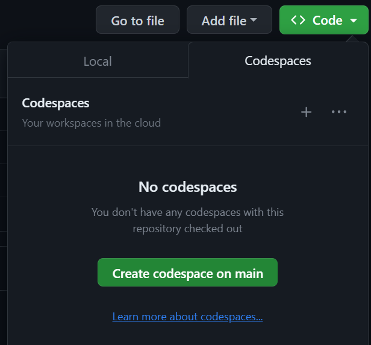
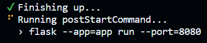
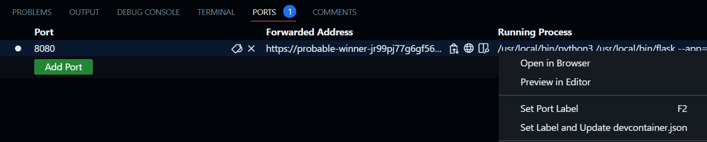
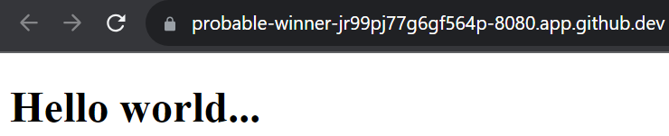

# A Sample Dev Container

This will work with GitHub codespaces (either in browser or via your local VSCode - requires a VSCode extension).

This uses [the sample Python devcontainer](https://github.com/devcontainers/images/tree/main/src/python) as inspiration. Lots more sample environments [here](https://github.com/devcontainers/templates/tree/main/src).

Also interesting (but untested) is https://github.com/loft-sh/devpod which promises to read this file but spin up on local machines / any cloud.

Don't forget to delete your codespace after use, see below!

## Usage

To launch a new codespace, click the `Code` button, change to the `Codespaces` tab and click `Create codespace on main`.

The random, two word name for the codespace will be generated. In this case "probable winner".

The codespace will begin creation in a new browser window. Wait until the codespace is running.

You should see this command in the terminal. Leave it running.

Toggle over to the `Ports` tab and right click the row for port `8080`.

Choose `Open in browser`

The demo application should be displayed.

## Explanation

The codespace template is found in [.devcontainer/devcontainer.json](.devcontainer/devcontainer.json).

In this example, a custom container is built from the [Dockerfile](.devcontainer/Dockerfile) (but you can also reference an existing image).

After the container is built and running, the `postStartCommand` (see [.devcontainer/devcontainer.json](.devcontainer/devcontainer.json)) is used to run a flask web application server automatically for you.

The `forwardPorts` directive in [.devcontainer/devcontainer.json](.devcontainer/devcontainer.json) is used to privately (only to your GitHub user) expose port 8080 and make the application available.

## Codespace teardown

Go to https://github.com/codespaces and delete your codespace to avoid unneccessary charges!

## Links

- [DevContainer features are documented here](https://github.com/devcontainers/features)